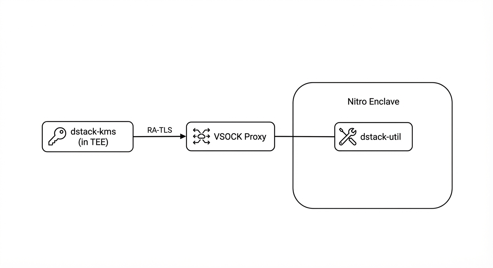

# Run a Workload on AWS Nitro

This guide explains how to deploy a Docker application as a Nitro Enclave using the official dstack template.

> **Important:** On AWS Nitro, your workload runs inside an **AWS Enclave OS image** — not a dstack CVM. There is no Guest Agent. `dstack-util` is packaged into the Enclave for attestation and key retrieval. You control how keys are used (e.g., encrypting disk, decrypting model weights).

## Prerequisites

- An AWS account with permissions to launch EC2 instances and manage Nitro Enclaves
- AWS CLI installed and configured (`aws configure`)
- Docker installed locally
- The [dstack-nitro-enclave-app-template](https://github.com/Phala-Network/dstack-nitro-enclave-app-template) repository

## Overview

The deployment process:

1. **Create your app from the template** — Set up your Nitro Enclave application
2. **Replace the KMS root CA certificate** — **Required before building**
3. **Configure and build the EIF** — Build the Enclave Image File and get measurements
4. **Register OS_IMAGE_HASH on-chain** — Authorize the enclave to receive keys
5. **Deploy on EC2** — Launch the enclave on AWS

### Key Delivery via KMS

On AWS Nitro, your enclave retrieves keys from an external **dstack-kms** service. Unlike GCP (where the Guest Agent handles everything automatically), on Nitro the `dstack-util` tool contacts the KMS through a VSOCK proxy running on the host EC2 instance.

**KMS Options:**

| Option | Description | When to Use |
|--------|-------------|-------------|
| **Phala Official KMS** | Use the KMS hosted by Phala Network | Quick start, development, testing |
| **Self-hosted KMS** | Deploy your own KMS instance | Production, compliance requirements, full control |

For self-hosted KMS, you can deploy on:
- **GCP** — See [Run a dstack-kms CVM on GCP](run-dstack-kms-on-gcp.md)
- **Intel TDX Bare Metal** — Contact Phala for deployment guide

> **Note:** The KMS only runs on GCP or Intel TDX bare metal. Nitro workloads can retrieve keys from any KMS (official or self-hosted).



This means:
1. `dstack-util` inside the Enclave sends a key request via VSOCK to the proxy on the host
2. The proxy forwards the request to the dstack-kms over the network (RA-TLS)
3. KMS verifies the Enclave's attestation (NSM Attestation Document)
4. If verified, KMS delivers the key back through the encrypted channel
5. `dstack-util` saves the key to `/var/run/dstack/keys.json` for your application to use

> **Key difference from GCP:** On GCP, the Guest Agent manages the entire key lifecycle including automatic disk encryption. On Nitro, `dstack-util` only retrieves the key — your application is responsible for using it (e.g., encrypting model weights, decrypting secrets).

For more details, see [KMS and Key Delivery](../concepts/kms-and-key-delivery.md).

---

## Step 1: Create Your App from the Template

```bash
# Create a new repository from the template
gh repo create my-enclave-app \
  --template Phala-Network/dstack-nitro-enclave-app-template \
  --private

# Clone your repository
git clone https://github.com/YOUR_USER/my-enclave-app.git
cd my-enclave-app
```

---

## Step 2: Replace the KMS Root CA Certificate

> ⚠️ **This step is REQUIRED.** The template comes with a placeholder file that is **NOT a valid certificate**. You must replace it before building.

The Enclave uses `app/root_ca.pem` to pin the KMS TLS connection. This certificate is **baked into the Docker image** and **affects the OS_IMAGE_HASH**.

```bash
# Get the root CA certificate from your running KMS
curl -sk https://<kms-host>:12001/prpc/KmsService.GetTempCaCert \
  | jq -r .caCert > app/root_ca.pem
```

> **Important:** If the KMS root CA changes (e.g., KMS reboots), you must update this file and rebuild. The new build will have a different OS_IMAGE_HASH.

---

## Step 3: Configure and Build the EIF

### 3.1 Understand the Template Variables

The `app/entrypoint.sh` contains template variables:

```bash
KMS_URL="__KMS_URL__"
APP_ID="__APP_ID__"
```

These are replaced automatically by the build script or GitHub Actions workflow. **Do not edit them manually** — pass the values via environment variables instead.

### 3.2 Option A: Local Build

```bash
# Using pre-built dstack-util binary
DSTACK_UTIL=/path/to/dstack-util \
KMS_URL=https://your-kms:12001 \
APP_ID=0xYOUR_APP_ID \
  ./scripts/build-eif.sh

# Or build dstack-util from source (requires Rust + musl target)
KMS_URL=https://your-kms:12001 \
APP_ID=0xYOUR_APP_ID \
DSTACK_COMMIT=14963a2ccb0ec7bef8a496c1ac5ac40f5593145d \
  ./scripts/build-eif.sh
```

### 3.3 Option B: GitHub Actions (Recommended)

Push a version tag to trigger the build:

```bash
git add .
git commit -m "Configure enclave app"
git push origin main

# Create a release tag to trigger the build
git tag v0.1.0
git push origin v0.1.0
```

Or use **Actions → Run workflow** for manual builds with custom parameters:

| Input | Description |
|-------|-------------|
| `kms_url` | KMS URL baked into the image |
| `app_id` | App ID baked into the image |
| `dstack_commit` | dstack-cloud commit for building dstack-util |

### 3.4 Build Output

Both methods produce files in `./output/`:

| File | Description |
|------|-------------|
| `enclave.eif` | EIF image, ready to run with `nitro-cli run-enclave` |
| `measurements.json` | PCR values and OS_IMAGE_HASH |
| `measurements.sigstore.json` | Sigstore attestation bundle (GitHub Actions only) |

The console output shows:

```
PCR0: <hash>
PCR1: <hash>
PCR2: <hash>
OS_IMAGE_HASH: <combined-hash>
```

**OS_IMAGE_HASH** = `sha256(PCR0 || PCR1 || PCR2)`

| PCR | What It Measures |
|-----|------------------|
| **PCR0** | Complete EIF content hash |
| **PCR1** | Linux kernel and boot ramdisk |
| **PCR2** | Application layer (Docker image filesystem) |

### 3.5 Verify Sigstore Attestation (Optional)

For GitHub Actions builds, you can verify the attestation:

```bash
# Download release assets
gh release download v0.1.0 -p 'measurements.json' -p 'measurements.sigstore.json'

# Rebuild PCR payload
python3 -c "
import sys, json
m = json.load(open('measurements.json'))
sys.stdout.buffer.write(
    bytes.fromhex(m['PCR0']) + bytes.fromhex(m['PCR1']) + bytes.fromhex(m['PCR2'])
)
" > pcr_payload.bin

# Verify
cosign verify-blob-attestation \
  --bundle measurements.sigstore.json \
  --certificate-oidc-issuer https://token.actions.githubusercontent.com \
  --certificate-identity-regexp "github.com/<owner>/<repo>" \
  --type https://dstack.dev/nitro-enclave/measurements/v1 \
  pcr_payload.bin
```

Or search on Rekor:
```
https://search.sigstore.dev/?hash=<os_image_hash without 0x prefix>
```

---

## Step 4: Register OS_IMAGE_HASH On-chain

Before KMS will deliver keys, you must register the OS_IMAGE_HASH.

### Development Environment

For local development or isolated test environments:

```bash
cd dstack/kms/auth-eth
npx hardhat kms:add-image <OS_IMAGE_HASH> --network <your-network>
```

This is convenient for quick iteration but bypasses governance controls.

### Production Environment

In production, image registration **must not** be done directly from an EOA. Instead:

1. Use the `OS_IMAGE_HASH` (and other measurement metadata from the release) as input for a governance proposal
2. Create a transaction to call the appropriate registration function on the KMS governance contract
3. Target your governance multisig (e.g., Safe wallet)
4. Let the transaction go through your configured timelock (cooling period)
5. Execute after the timelock delay and required approvals

See [Register Workload Measurements](register-enclave-measurement.md) for the full governance flow.

---

## Step 5: Deploy on EC2

### 5.1 Launch an EC2 Instance

Launch an EC2 instance with Nitro Enclave support:

| Setting | Value |
|---------|-------|
| **Instance type** | c5.xlarge or larger (c5, m5, r5 series) |
| **AMI** | Amazon Linux 2023 |
| **Nitro Enclaves** | Enable in instance options |

### 5.2 Install Nitro Enclaves CLI

```bash
# On the EC2 instance
sudo yum install -y aws-nitro-enclaves-cli
sudo systemctl enable nitro-enclaves-allocator.service
sudo systemctl start nitro-enclaves-allocator.service
```

### 5.3 Configure Resources

Edit `/etc/nitro_enclaves/allocator.yaml`:

```yaml
memory_mib: 2048
cpu_count: 2
```

After editing:
```bash
sudo systemctl restart nitro-enclaves-allocator.service
```

### 5.4 Download and Run the EIF

```bash
# Download the EIF from GitHub Release
gh release download v0.1.0 -p 'enclave.eif'

# Run the enclave
nitro-cli run-enclave \
  --eif-path enclave.eif \
  --cpu-count 2 \
  --memory 2048
```

### 5.5 Verify the Enclave

```bash
# List running enclaves
nitro-cli describe-enclaves

# Check console output
nitro-cli console
```

---

## Customizing the Entrypoint

Edit `app/entrypoint.sh` to implement your business logic. The template includes an example that uses `dstack-util get-keys` to fetch keys from the KMS:

```bash
#!/bin/sh

# Environment variables are set by the build process
KMS_URL="__KMS_URL__"
APP_ID="__APP_ID__"

# Build args for dstack-util
ARGS="--kms-url ${KMS_URL} --root-ca /app/root_ca.pem"
if [ -n "${APP_ID}" ] && [ "${APP_ID}" != "__APP_ID__" ]; then
    ARGS="${ARGS} --app-id ${APP_ID}"
fi

# Example: Get keys from KMS
HTTPS_PROXY="http://127.0.0.1:3128" HTTP_PROXY="${HTTPS_PROXY}" \
ALL_PROXY="${HTTPS_PROXY}" NO_PROXY="127.0.0.1,localhost" \
/app/dstack-util get-keys ${ARGS} --key-spec '["ed25519", "secp256k1"]'

# Keys are available in /var/run/dstack/keys.json
# Your application logic here...
```

### Key Points

- **VSOCK Proxy**: The entrypoint sets up a proxy via socat for network access from inside the Enclave
- **Template Variables**: `__KMS_URL__` and `__APP_ID__` are replaced during build
- **Root CA**: The certificate at `/app/root_ca.pem` is baked into the image

---

## What Affects OS_IMAGE_HASH

The following are **all baked into the Docker image** and affect the OS_IMAGE_HASH:

| Item | Location |
|------|----------|
| KMS URL | Baked into `entrypoint.sh` during build |
| APP ID | Baked into `entrypoint.sh` during build |
| `app/root_ca.pem` | KMS root CA certificate |

**Always use the same values for preview (`--show-mrs`) and production builds.**

---

## Repository Structure

```
my-enclave-app/
├── app/
│   ├── Dockerfile          # Enclave image definition (Alpine + dstack-util)
│   ├── entrypoint.sh       # Enclave startup script
│   └── root_ca.pem         # ⚠️ KMS root CA — MUST REPLACE before building
├── scripts/
│   └── build-eif.sh        # Local build script
├── .github/workflows/
│   └── build-and-release.yml  # CI pipeline: build → measure → attest → release
└── output/                  # Build outputs
    ├── enclave.eif
    ├── measurements.json
    └── measurements.sigstore.json
```

---

## Troubleshooting

| Issue | Solution |
|-------|----------|
| `allocate-enclaves: error` | Ensure the EC2 instance type supports Nitro Enclaves (c5, m5, r5 series). Check that Nitro Enclave support is enabled. |
| "Enclave image too large" | Reduce Docker image size. Use multi-stage builds. Increase memory allocation. |
| Cannot connect to KMS | Verify VSOCK proxy is running. Check security group allows outbound HTTPS. |
| Enclave starts then exits | Check `nitro-cli console` output. Common causes: insufficient memory, missing dependencies in Docker image. |
| Attestation verification fails | Ensure the Enclave is running on genuine Nitro hardware. Verify NSM is accessible. Check that the OS_IMAGE_HASH is registered on-chain. |
| PCR values are all zeros | You're running in debug mode. Debug mode zeros PCR values for testing. Use production mode for real deployments. |
| OS_IMAGE_HASH doesn't match | Ensure KMS_URL, APP_ID, and root_ca.pem are identical between preview and production builds. |
| Root CA certificate error | You forgot to replace `app/root_ca.pem` with a valid certificate before building. |

---

## Differences from GCP Deployment

| Aspect | GCP (dstack CVM) | AWS Nitro (Enclave) |
|--------|------------------|---------------------|
| Deployment tool | `dstack-cloud` CLI | `./scripts/build-eif.sh` + `nitro-cli` |
| OS inside TEE | dstack OS | Enclave OS (AWS-provided) |
| Guest Agent | Yes | No (uses `dstack-util`) |
| Application format | `docker-compose.yaml` | `Dockerfile` |
| Disk encryption | Automatic (Guest Agent) | User-managed (key from `dstack-util`) |
| Network access | Direct | Via VSOCK proxy |
| Persistent storage | Yes | No (stateless) |
| Resource allocation | Can resize VM | Static at launch |
| Boot time | ~2-3 minutes | ~30 seconds |

---

## Next Steps

- **[Register Workload Measurements](register-enclave-measurement.md)** — Register the OS_IMAGE_HASH on-chain
- **[Run a dstack-kms on GCP](run-dstack-kms-on-gcp.md)** — Deploy KMS on GCP (Nitro supports workloads only, not KMS)
- **[Concept: Nitro Enclave](../concepts/nitro-enclave.md)** — Understand Nitro Enclave architecture
